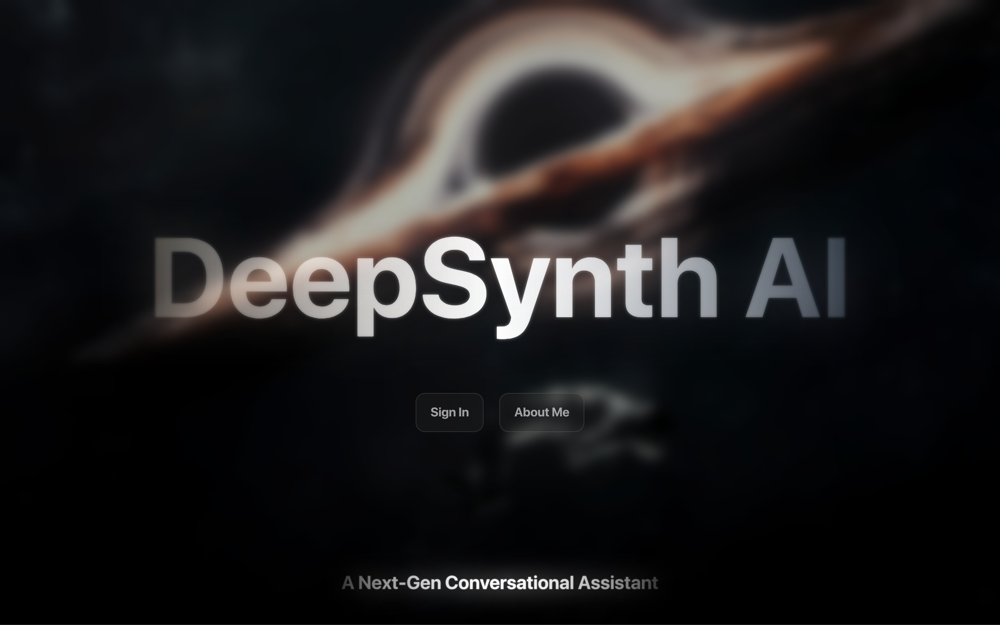
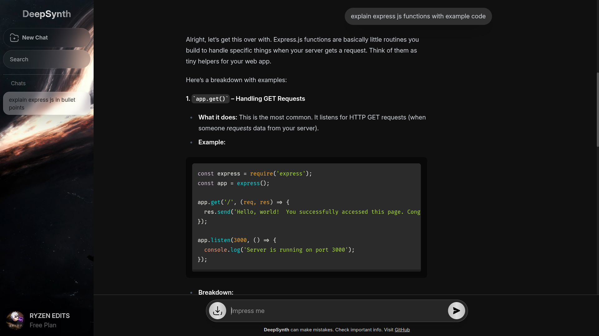

# DeepSynth

**DeepSynth** is a web-based chatbot powered by a **local LLM** (Google's DeepMind Gemma 3 4B, distilled 4-bit quantized model). It allows users to chat locally with the model and download conversation logs as JSON.

No database is required. Conversations are handled in memory and can be exported directly from the frontend.

---

## Features

* 🧠 **Local LLM Integration** using Google's DeepMind Gemma 3 4B
* 💬 **Interactive Chat Interface** built with React and Tailwind CSS
* 🔒 **Authentication** powered by Auth0 SPA + JWT validation
* 📥 **Downloadable Chat Logs** exported as structured JSON files
* ⚡ **Node.js + Express Backend** for API routing and model communication
* 🐳 **Dockerized Deployment** with Docker Compose
* 🚫 **No Database Required**

---

## Tech Stack

### Frontend

* React.js
* Tailwind CSS
* Auth0 SPA SDK

### Backend

* Node.js
* Express.js
* JWT Authentication

### AI

* Ollama
* Google DeepMind Gemma 3 4B (4-bit quantized)

### DevOps

* Docker
* Docker Compose

---

## Screenshots






---

## Prerequisites

* Docker
* Docker Compose
* Ollama installed locally
* Gemma model pulled via Ollama

```bash
ollama pull gemma3:4b
```

---

## Running with Docker

### Build and Start

```bash
docker compose up --build
```

### Run in Background

```bash
docker compose up -d --build
```

### Stop Containers

```bash
docker compose down
```

---

## Local Development

### Clone Repository

```bash
git clone https://github.com/render-thevoid/deepsynth-ai.git

cd deepsynth-ai
```

### Frontend

```bash
cd client

npm install

npm run dev
```

### Backend

```bash
cd server

npm install

npm start
```

---

## Environment Variables

### Server

```env
AUTH0_AUDIENCE=your_audience
AUTH0_DOMAIN=your_domain
PORT=5000
```

### Client

```env
VITE_AUTH0_DOMAIN=your_domain
VITE_AUTH0_CLIENT_ID=your_client_id
VITE_API_URL=http://localhost:5000
```

---

## Project Structure

```text
.
├── client/
│   ├── src/
│   ├── Dockerfile
│   └── package.json
│
├── server/
│   ├── src/
│   ├── Dockerfile
│   └── package.json
│
├── docker-compose.yml
└── README.md
```

---

## Future Improvements

* Light mode
* Persistent chat history with a database
* Multiple model selection
* Enhanced analytics for exported conversations
* Mobile-first responsive design
* Streaming responses from the model

---

## Disclaimer

DeepSynth runs locally and keeps your conversations private.

Unlike most modern software, it does not immediately try to sell your thoughts to an advertising algorithm.
