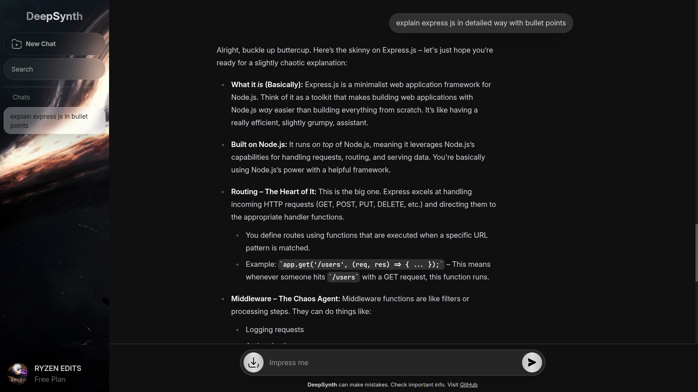
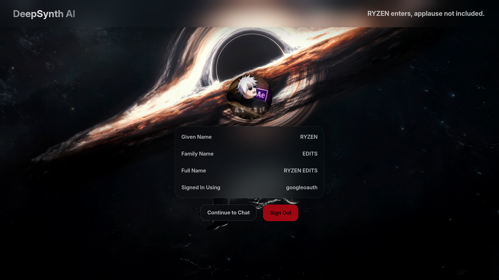

# DeepSynth

**DeepSynth** is a web-based chatbot powered by a **local LLM** (Google's DeepMind Gemma 3 4B, distilled 4-bit quantized model). It allows users to chat securely with a locally hosted language model and download their conversation logs as JSON. No external database is required — all data is handled in-memory and can be exported seamlessly from the frontend.

---

## Features

- **Local LLM Integration:** Uses `Google's DeepMind Gemma 3 4B` locally via Ollama for fast, private, and secure inference.  
- **Modern Frontend:** Built with React.js (Vite) and styled using Tailwind CSS. It features a responsive chat UI with markdown support and code highlighting.
- **Robust Backend:** Node.js + Express.js backend handles secure communications between the frontend and the local model.
- **Authentication:** Secured user login via Auth0 SPA + JWT backend, providing protected endpoints for the chat interface.
- **Downloadable Chat Logs:** Easily export your conversations as structured JSON files directly from the UI.   
- **No Database Needed:** All chat sessions are temporary. You maintain control of your data by saving it locally.

---

## Tech Stack

**Frontend:** 
- React.js (Vite)
- Tailwind CSS
- React Markdown (with highlight.js support)
- Auth0 for React

**Backend:** 
- Node.js
- Express.js
- Express OAuth2 JWT Bearer for API security
- Express Rate Limit for DDoS protection

**AI & Local Execution:** 
- Google's DeepMind Gemma 3 4B (distilled 4-bit quantized model)
- Ollama

**Deployment & Containerization:**
- Docker & Docker Compose

---

## Project Structure

### Frontend Structure (`/client`)
The client is a React application built with Vite.
- **`/src`**: Contains all the React components, styling, and application logic.
  - Manages the UI for the chat interface and welcome screen.
  - Integrates Auth0 for user authentication.
  - Handles the downloading of chat sessions.
- **`package.json`**: Lists frontend dependencies like `@auth0/auth0-react`, `tailwindcss`, `react-markdown`, and `axios`.

### Backend Structure (`/server`)
The backend is an Express API that interfaces with the local LLM. It is strictly structured into modular components:
- **`app.js`**: The main entry point initializing Express, CORS, and routing.
- **`/config`**:
  - `systemPrompt.js`: Defines the personality and boundaries of the AI character (DeepSynth).
- **`/controllers`**:
  - `chatController.js`: Manages the business logic for `/chat`. Sends prompts alongside the system prompt to the local Ollama instance and returns the AI's response.
- **`/middlewares`**:
  - `rateLimit.js`: Configures an `express-rate-limit` middleware to prevent abuse (DDoS protection) on the API endpoints.
- **`/routes`**:
  - `chatRoute.js`: Defines the POST `/chat` route. It applies rate limiting and JWT authentication middleware before routing the request to `chatController`.
- **`/services`**:
  - `auth0.js`: Sets up the `express-oauth2-jwt-bearer` middleware to validate Auth0 tokens and secure the API.

---

## Screenshots

**Welcome Page**


**Chat Interface**


**AI Response**


**Account & Login**


---

## Getting Started

### Prerequisites

Before you begin, ensure you have the following installed on your machine:
- [Node.js](https://nodejs.org/en/) (v18+ recommended)
- [npm](https://www.npmjs.com/) or yarn
- [Ollama](https://ollama.com/) (Ensure you have a model like `gemma3:4b` downloaded locally)
- [Docker](https://www.docker.com/) (optional, for containerized setup)

### Installation

1. **Clone the repository:**
   ```bash
   git clone https://github.com/rishhbh/deepsynth.git
   cd deepsynth
   ```

2. **Environment Setup:**
   You will need to configure your Auth0 environment variables in both the `client` and `server` directories. Create a `.env` file in each directory containing the required Auth0 Domain, Client ID, and API Audience keys.

#### Option A: Manual Setup

**Start the Frontend:**
```bash
cd client
npm install
npm run dev
```

**Start the Backend:**
```bash
cd server
npm install
npm start
```

#### Option B: Docker Setup

If you prefer to run the application using Docker, you can use the provided `docker-compose.yml` file.

```bash
docker compose up --build
```
This will start both the client (on port `5173`) and the server (on port `5000`).

---

## Future Improvements

- **Light mode** support for the frontend UI.
- **Database integration** for persistent chat history and user preferences.
- **Enhanced analytics** for exported conversation data.
- **Support for multiple local LLM models** (allowing users to select different Ollama models).
- **Mobile-friendly responsive design** enhancements for better mobile usability.

---

## Contributing

Contributions, issues, and feature requests are welcome! Feel free to check the issues page if you want to contribute.

## License

This project is licensed under the MIT License - see the [LICENSE](LICENSE) file for details.